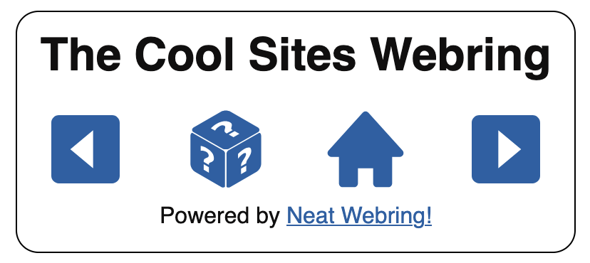

# Neat Webring!

Neat Webring! is the easiest way to set up a webring! No coding experience required!

You don't need to know HTML or any other code. You just need the following:

* a website, where you can upload files
* a program for editing text, like Notepad or TextEdit

## Setting up your webring

First, unzip the `neat-webring.zip` ZIP file (you can usually just double-click on it and your computer should know what to do). This should create a folder named `neat-webring`

Now follow the steps below.

### 1. Edit your webring settings

Here's where you'll set up your webring name and other information.

Open the `settings.txt` file in your editor. You'll see a number of fields you can fill in:

* `webringName`: the name of your webring! This will appear at the top of the widget.

The `webringName` field is the only required field. The rest of the fields are optional. You can leave them blank or remove them entirely.

* `homepage`: this is the link to where your webring homepage is. By default, this points to the automatically generated homepage (see below), but you can point it somewhere else if you like.
* `description`: describe your webring.
* `owner`: your name or handle
* `showRandomIcon`: change this to "false" to hide the random site icon
* `showHomeIcon`: change this to "false" to hide the webring homepage icon

### 2. Create the list of websites

Below the webring settings you'll see a list of example websites. You can delete these when you're finished.

To add a new site to the webring, just add another entry to the list using the following format:

```
---
name: My Friend's Awesome Website
link: https://my-awesome-friend.net
description: This is my best friend's site. I love them.
```

Only `name` and `link` are required. The `description` line is optional. You can leave it out if you want.

IMPORTANT: The `link` fields should always start with `http://` or `https://` or they will be filtered out of the list.

Separate the site entries with three hyphens: `---`

When you're done, save the `settings.txt` file.

> You shouldn't have to touch anything inside the `embed` and `home` folders. (In fact, it's better if you didn't.)

When you're done, save the `settings.txt` file.

### 3. Upload the folder

1. Upload the whole `neat-webring` folder to the root directory website (the whole folder, not just the files inside). It should be available online following your domain name. If you're not sure, try opening the following link in a browser (replace "your-website.com" with your actually website domain, of course!)

`https://your-website.com/neat-webring/home/`

If a list of the sites in your webring appears in the browser, you did it right! 🎉

## Putting the webring widget on any website

To put the webring widgets on any website, copy and paste the following script tag into a page on the website. Most people will put it in the footer or a sidebar, but you can basically put it anywhere. Wherever you end up putting it, the widget should appear.

```html
<script src="http://your-website.com/neat-webring/embed/webring.js"></script>

```

> If you're using WordPress or Squarespace, you'll need to create a Code Block to put HTML in. Follow the documentation for your website builder.


The default widget should look like this:



Share the script tag with anyone you want to include in your webring. They can paste the same tag into their own website and keep the ring going.

You're basically done!

## BONUS FEATURE! An automatic homepage for your webring

Neat Webring! automatically creates a homepage for your webring where vistors can see links to all sites in the ring. You can find it at:

`http://your-website.com/neat-webring/home/`

If you're familiar with HTML and CSS you can redesign this page however you like. You can also move it to a new location on your website, so long as you change the value of `homepage` in the `settings.txt` file.

## BONUS FEATURE! Dark mode!

Neat Webring! has a built-in dark mode which will toggle on if the user sets dark mode on their computer or phone.

You can also force the dark mode anytime. To do this, add `data-dark-mode="true"` to the `<script>` tag:

```html
<script src="http://your-website.com/neat-webring/embed/webring.js" data-dark-mode="true"></script>

```
The default dark mode widget looks like this:


## Further info

The webring widget will try to stretch and fill the area it sits in. It will shrink as low as 250 pixels wide and stretch up to 400 pixels wide.

If you want to mess with the widget styling, you can find the CSS rules in the `core.css` file in the `embed` folder.

## Troubleshooting

Make sure the website is actually in the `settings.txt` list and make sure it's spelled correctly.

Check that the script tag is pointing to the right place. It should be `http://your-website.com/neat-webring/embed/webring.js`.

Make sure you haven't moved the location of the `/neat-webring/` folder.

Check that each link in `settings.txt` starts with an `http://` or `https://`.

Make sure none of the site names have a colon character. This can break the widget! If you absolutely need the colon, enclose the site name in quotes:

```
❌ name: Dragon Toucher: The Complete Series
✅ name: "Dragon Toucher: The Complete Series"
```

---

